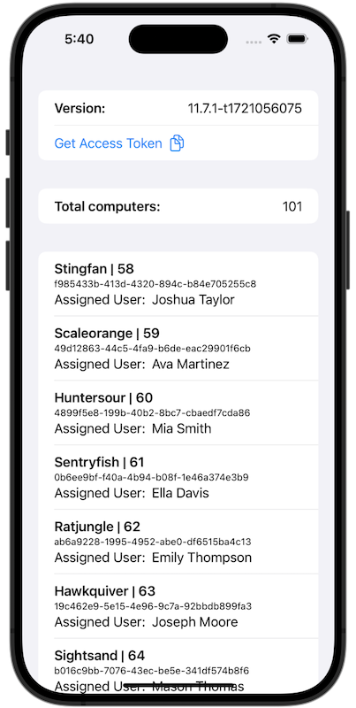

# Jamf Pro API Client Example

This is an example app that uses a Jamf Pro API client created by the [swift-openapi-generator](https://github.com/apple/swift-openapi-generator).

This repo is a companion to this [blog post on dev.to](https://dev.to/brysontyrrell/using-the-swift-openapi-generator-for-the-jamf-pro-api-p2k/manage) if you want a full walkthrough of the code and setup process.



## Running the app

Clone this repository and open it in Xcode. The package dependencies should automatically install.

Open `ContentView.swift`. In the `ContentView` struct there is a `client` private var that takes the hostname, client ID, and client secret for a Jamf Pro instance. You will need to replace the placeholder `"..."` values with your own.

```swift
@State private var client = JamfProAPIClient(
    hostname: "...",
    clientID: "...",
    clientSecret: "..."
)
```

>Do ***NOT*** commit secrets to any fork of this project you may make.

By default, this project defaults to using an iOS simulator. You can switch to building to your Mac and it will still run.

Press ***⌘ + R*** to build and run.
